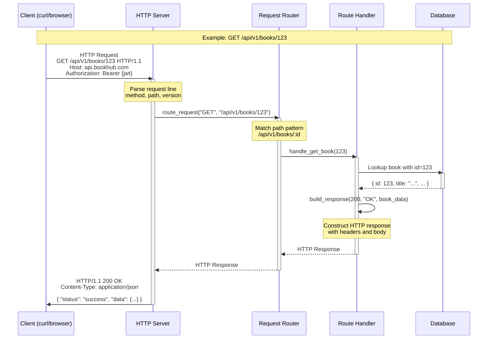

# API Design Practice

A repository for practicing and mastering API design patterns, best practices, and architectural decisions. This is a learning space to work through API design concepts and interview preparation.

## Purpose

- 🏗️ Practice designing robust, scalable APIs
- 📚 Learn from real-world API design patterns
- 🎯 Prepare for senior-level engineering interviews
- 📖 Document learnings and design decisions

## Current Project: BookHub

BookHub is a fictional startup building an online marketplace for book publishers. This project focuses on designing the Publisher API.

### Project Structure

```
Project/
├── specs/                    # Requirements and specifications
│   ├── company.md           # About BookHub
│   ├── book_schema.md       # Database schema
│   ├── project_requirements.md
│   └── things_to_build.md
│
└── api/                      # API designs and specifications
    ├── create-book-api/     # Create Book endpoint
    │   ├── README.md        # Overview with diagrams
    │   ├── request-model.md
    │   ├── success-response.md
    │   ├── error-response.md
    │   └── openapi.yaml     # OpenAPI 3.0 spec
    │
    └── finalize-book-api-spec.md
```

### Testing the API

Import the OpenAPI spec into Postman or use Prism mock server:

```bash
# Install Prism
npm install -g @stoplight/prism-cli

# Start mock server
cd "Project/api/create-book-api"
prism mock openapi.yaml

# Test endpoints
curl -X POST http://localhost:4010/api/v1/books \
  -H 'Content-Type: application/json' \
  -H 'Prefer: code=201' \
  -d '{"title": "My Book", "author": "Kat Perreira", "isbn": "978-3-16-148410-0", "price": 29.99}'
```

## Topics

- RESTful API design principles
- API versioning and compatibility
- Error handling and status codes
- Authentication and authorization
- Rate limiting and throttling
- API documentation
- Microservices communication patterns

## How HTTP Works

A visual representation of the HTTP request-response cycle:



### HTTP Request Structure

```
POST /api/v1/books HTTP/1.1          ← Request Line (Method, Path, Version)
Host: api.bookhub.com                 ← Headers
Content-Type: application/json        ← Headers
Authorization: Bearer eyJhbG...       ← Headers
                                      ← Empty line separates headers from body
{                                     ← Body (JSON data)
  "title": "My Book",
  "author": "Kat Perreira"
}
```

### HTTP Response Structure

```
HTTP/1.1 201 Created                  ← Status Line (Version, Code, Message)
Content-Type: application/json        ← Headers
Location: /api/v1/books/123           ← Headers
                                      ← Empty line separates headers from body
{                                     ← Body (JSON data)
  "status": "success",
  "data": { "bookId": "123", ... }
}
```

## Author

Kat Perreira ♡
