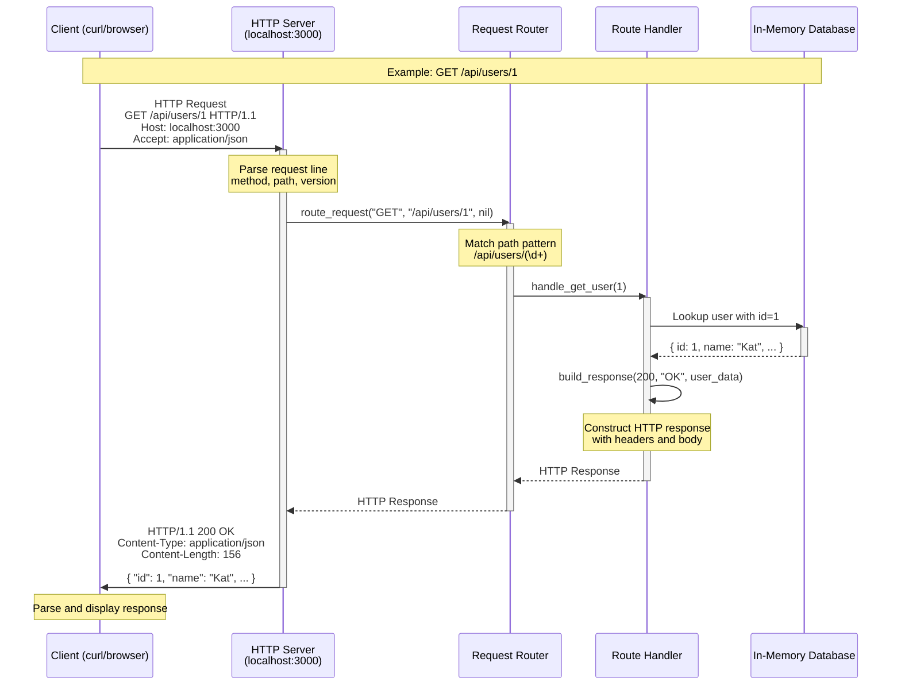

# API Design Practice

A repository for practicing and mastering API design patterns, best practices, and architectural decisions. This is a learning space to work through API design concepts and interview preparation.

## Purpose

- 🏗️ Practice designing robust, scalable APIs
- 📚 Learn from real-world API design patterns
- 🎯 Prepare for senior-level engineering interviews
- 📖 Document learnings and design decisions

## Getting Started

### Running the HTTP Server Example

```bash
# Start the server
ruby workspace/practice.rb

# In another terminal, test the endpoints
curl http://localhost:3000/api/users
curl http://localhost:3000/api/users/1
curl -X POST http://localhost:3000/api/users -H 'Content-Type: application/json' -d '{"name":"New User","email":"new@example.com"}'
curl -X DELETE http://localhost:3000/api/users/2
```

## How HTTP Works

Below is a visual representation of the HTTP request-response cycle implemented in our server:



### Request Flow Breakdown

1. **Client sends HTTP request** - Contains method (GET/POST/etc), path, headers, and optional body
2. **Server accepts connection** - TCPServer listens on port 3000 and accepts incoming connections
3. **Parse request** - Extracts method, path, HTTP version, headers, and body
4. **Route matching** - Router checks path patterns to find the right handler
5. **Handler execution** - Executes business logic (fetch/create/update/delete data)
6. **Build response** - Constructs HTTP response with status code, headers, and body
7. **Send response** - Server sends formatted HTTP response back to client
8. **Close connection** - Connection is closed after response is sent

### HTTP Request Structure

```
GET /api/users/1 HTTP/1.1          ← Request Line (Method, Path, Version)
Host: localhost:3000                ← Headers
Accept: application/json            ← Headers
                                    ← Empty line separates headers from body
                                    ← Body (optional, not used in GET)
```

### HTTP Response Structure

```
HTTP/1.1 200 OK                     ← Status Line (Version, Code, Message)
Content-Type: application/json      ← Headers
Content-Length: 156                 ← Headers
Date: Tue, 02 Dec 2025 10:30:00 GMT ← Headers
                                    ← Empty line separates headers from body
{                                   ← Body (JSON data)
  "id": 1,
  "name": "Kat Perreira",
  "email": "kat@example.com"
}
```

## Topics

- RESTful API design principles
- API versioning and compatibility
- Error handling and status codes
- Authentication and authorization
- Rate limiting and throttling
- API documentation
- Microservices communication patterns

## Author

Kat Perreira ♡